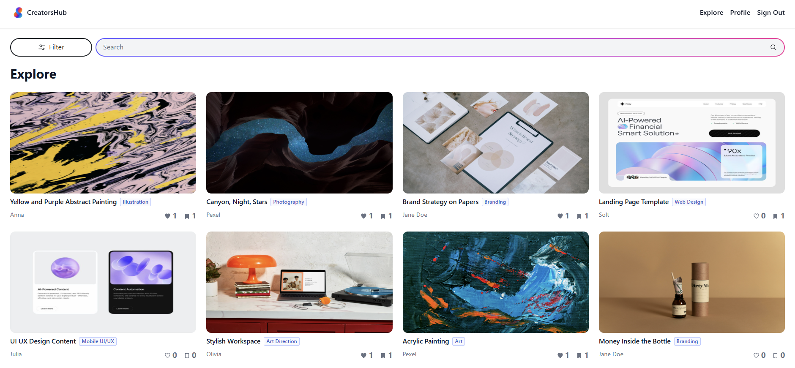
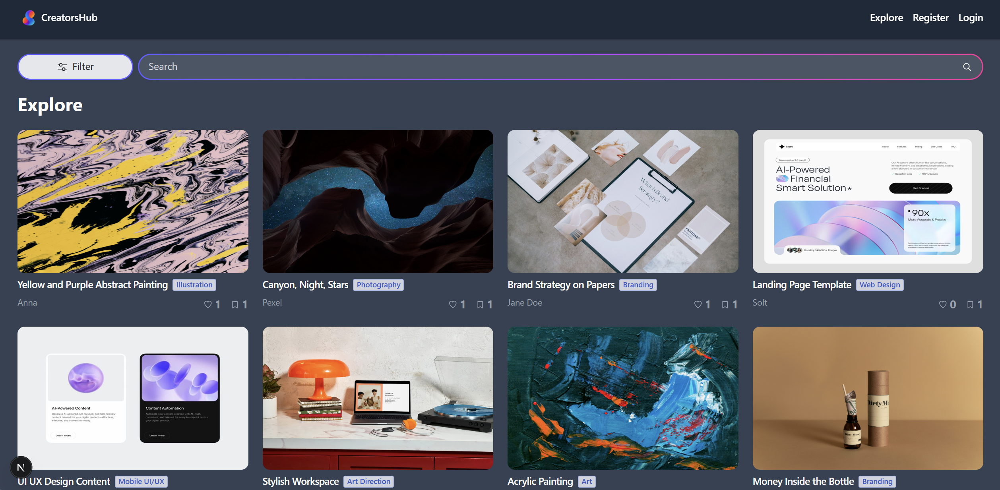
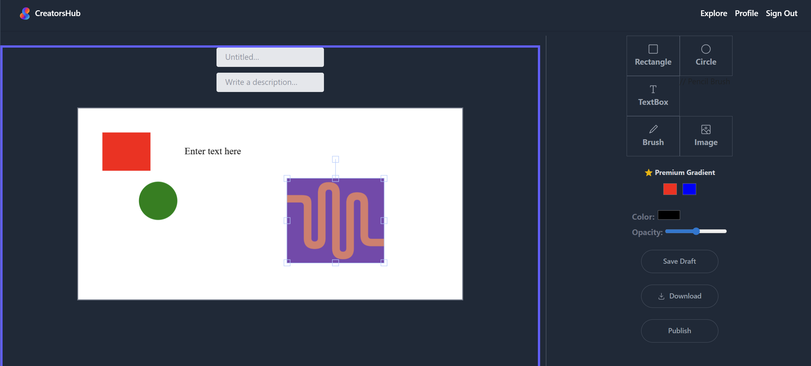

Portfolio Builder App

  
  
  

Introduction:
Portfolio Builder App is a web-based application that allows users to create and customize their own portfolios with ease. Inspired by platforms like Behance, the app enables users to visually design their portfolio by adding and arranging elements such as text and images on a canvas.
Built with a focus on flexibility and user creativity, this app provides an interactive and intuitive interface for users to showcase their work in a personalized way.

Features:

- Create and customize portfolios
- Users can build their own portfolio layouts by adding and editing content elements.
- Utilizes Fabric.js to allow users to freely position, resize, and style elements on a canvas.
- Changes made on the canvas are reflected instantly, providing a smooth editing experience.
- Clean and responsive interface built for ease of use and creativity.

Technologies Used:

- React – Frontend library for building user interfaces
- Tailwind CSS – Utility-first CSS framework for styling
- Fabric.js – Canvas-based library for drag-and-drop editing
- JavaScript (ES6+) – Core programming language

Usage:

- Add elements such as text and images to the canvas
- Drag, resize, and arrange components freely
- Customize your portfolio layout visually
- Design and preview your portfolio in real time

## Disclaimer

Some images used in the screenshots are sourced from free stock libraries and are used for demonstration purposes only.
All application design and functionality were built by me.
